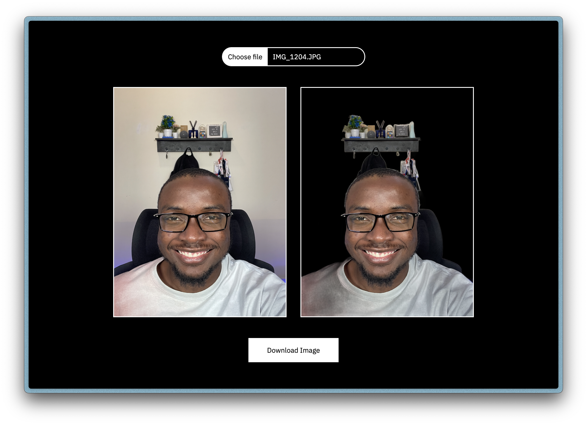
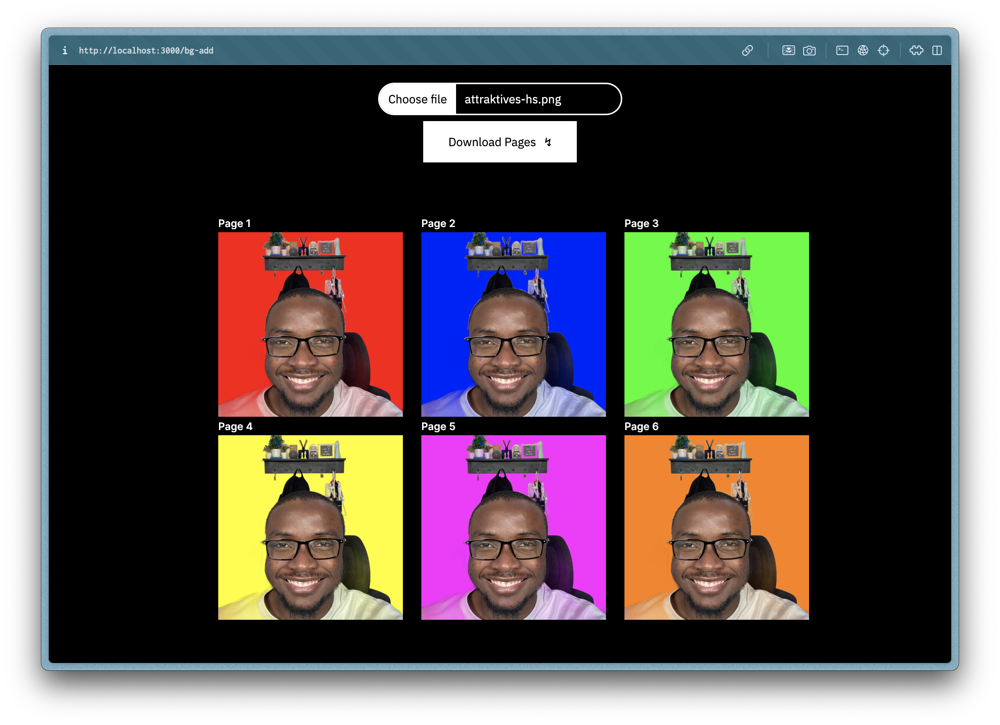
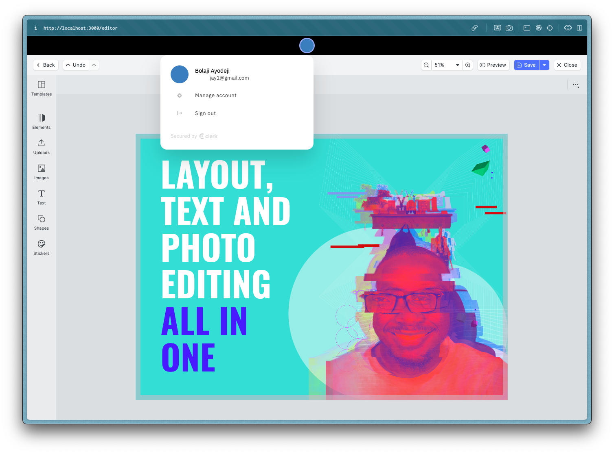

<div align="center">


A web application that enables users to remove the background of an image and craft attractive profile pictures for social media platforms.

---

[](https://attraktives-hs.vercel.app/start)
[](https://attraktives-hs.vercel.app/start)
[](https://attraktives-hs.vercel.app/start)

</div>

> [!TIP]
>
> Kindly read [this comprehensive tutorial](https://blog.bolajiayodeji.com/how-to-build-design-editing-apps-using-nextjs-clerk-and-imglys-cesdk-engine) to learn how to build editing apps using IMGLY’s [CE.SDK](https://img.ly/docs/cesdk?utm_source=https://bolajiayodeji.com) Engine and SDK.

---

## Table of Contents

* [Apps](#apps)
* [Features and Todos](#features-and-todos)
* [Important Files and Folders](#important-files-and-folders)
* [Getting Started](#getting-started)
* [Repo Stats Summary](#repo-stats-summary)
* [Contributors Guide](#contributors-guide)
* [License](#license)

---

## Apps

There are three apps in this project, namely:

1. Remove Image Background (`/bg-remove`): can be accessed with this [live link](https://attraktives-hs.vercel.app/bg-remove) (doesn't require a license).
2. Add Image Background Color (`/bg-add`): can be tested only in development using the demo license.
3. General Design Editor (`/editor`): can be tested only in development using the demo license.

## Features and Todos

* [x] Remove the background from an image ([try it live](https://attraktives-hs.vercel.app/bg-remove)).
* [x] The above uses the [ONNX model](https://onnx.ai) and WASM files hosted by IMG.LY.
* [x] Add background color options to a transparent image.
* [x] Create and edit designs with a Canva-like editor.
* [x] Authentication and protected pages.
* [x] Show download progress (background removal).
* [ ] Add background-removal plugin to the editor.

## Important Files and Folders

| **Path**                           | **Description**                                 |
| ---------------------------------- | ----------------------------------------------- |
| `.env.example`                     | Example file with all the required environment variables.  |
| `/app/auth`                        | `/auth/sign-in` and `auth/sign-up` authentication pages.    |
| `/app/bg-add/page.tsx`             | Page for the background removal app.            |
| `/app/bg-remove/page.tsx`          | Page for the background color add app.          |
| `/app/editor/page.tsx`             | Page for the general design editor app.         |
| `/app/start/page.tsx`              | Page for the start page (select app).           |
| `/app/components/editorCanvas.tsx` | React component for the `/editor` page.         |
| `/app/components/headshotCanvas.tsx` | React component for the `/bg-add` page.       |
| `/app/layout.tsx`                  | Shared UI for fonts and metadata configuration. |
| `/app/page.tsx`                    | Home page (`/`).                                |
| `/utils/grid.ts`                   | Utility file for the grid layout options.       |
| `middleware.ts`                    | Handle protected pages before processing all requests.     |

## Getting Started

To run this application locally, kindly follow the steps below:

1. Rename the `.env.example` file to `.env.local` and fill in the required environment variables (leave the pre-filled ones as they are).
    * `NEXT_PUBLIC_CESDK_LICENSE`: IMG.LY CE.SDK license (sign up for one or get a demo [here](https://img.ly/docs/cesdk/engine/quickstart)).
    * `NEXT_PUBLIC_CLERK_PUBLISHABLE_KEY`: Clerk publishable API key (sign up and copy this from the [dashboard](https://dashboard.clerk.com)).
    * `CLERK_SECRET_KEY`: Clerk secret API key (sign up and copy this from the [dashboard](https://dashboard.clerk.com)).

3. Install all required dependencies with the `npm install` command (or use `yarn` / `pnpm`).

4. Run the development server with the `npm run dev` command.

5. Open [`http://localhost:3000`](http://localhost:3000) with your browser to see the result.

6. All good! You can start modifying any page and the app will auto-update.

## Repo Stats Summary


## Contributors Guide

1. Fork [this repository](https://github.com/BolajiAyodeji/attraktives-headshot) (learn how to do this [here](https://help.github.com/articles/fork-a-repo)).

2. Clone the forked repository like so:

```bash
git clone https://github.com/<your username>/attraktives-headshot.git && cd attraktives-headshot
```

3. Make your changes and create a pull request ([learn how to do this](https://docs.github.com/en/github/collaborating-with-issues-and-pull-requests/creating-a-pull-request)).

4. I'll attend to your pull request soon and provide some feedback.

## License

This repository is published under the [MIT](LICENSE) license.

---

<div align="center">
<a href="https://bolajiayodeji.com" target="_blank" rel="noopener noreferrer"></a>
</div>
